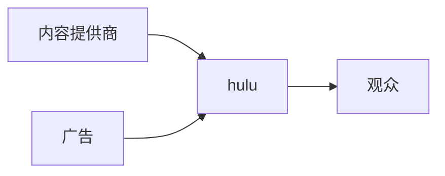

## 起源
2006年，美国电视上映，独家播放电视剧

hulu和发行商联系，买入电视剧的版权进行播放

2007年北京工作室开启

美国视频服务

## 什么是架构
架构——起源于建筑学

### 不是什么
不是要用最新最炫的技术

### 是什么
Important design decisions that is hard to change later

Design specific to given context

The ultimate purpose is to serve business requirements
<!-- more -->
## 方法论
### 关键
- Business      商业需要
- Constraints   约束
- Process       流程，制度
### 原则
- Divide and Conquer                        分治
- Trade-offer According to Requirements     按需求权衡
- Expect and Prepare for Failures           对失败有预期和准备

## hulu的架构

Domain-Driven Architecture 领域驱动架构

## 面向未来的架构
Always in Motion the Future is. --- 尤达大师

## 离职问题
把自己的利益和同事的利益联系在一起，让自己的人脉覆盖同事，找到自己的盟友

## 找工作
- 不要装
- 工作习惯和工作
- 企业是否有壁垒，有lisence
