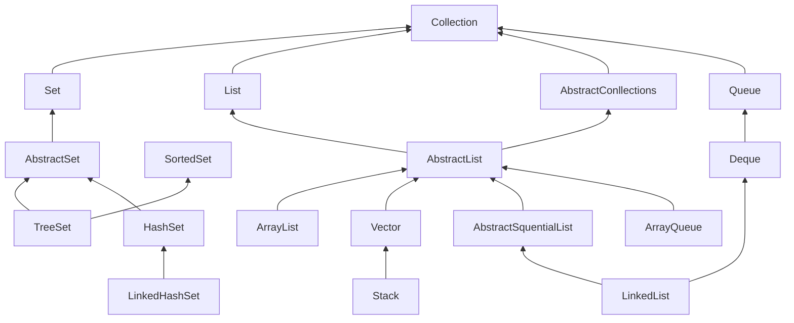
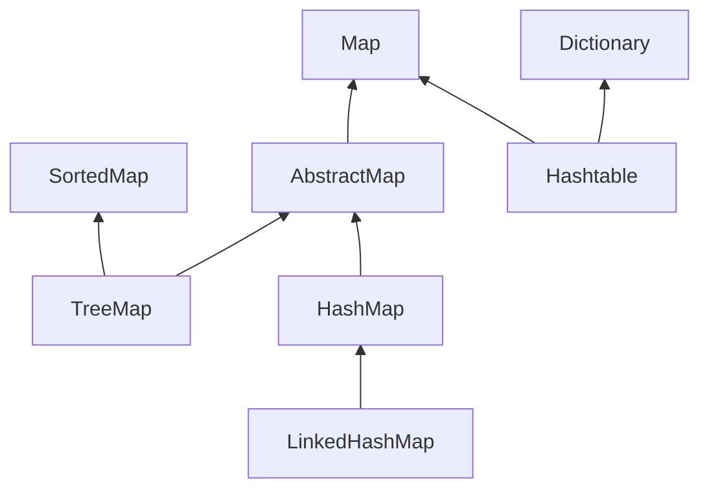
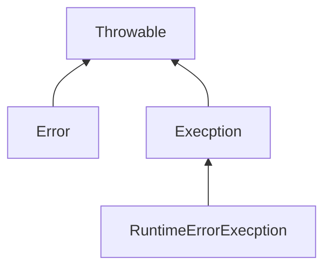

## 八种基本数据类型的大小，默认值以及他们的封装类
基本类型 | 大小 | 默认值 | 包装类
----|------|----|----|
byte | 1 byte  | （Byte）0 | Byte |
short | 2 byte | （short）0 | Short
int | 4 byte  | 0 | Integer |
long | 8 byte  | 0L | Long |
float | 4 byte | 0.0f | Float |
double | 8 byte | 0.0d | Double |
boolean | - | false | Boolean |
char | 2 | \u0000(null) | Charactor |
void | - | - | Void |

## 引用数据类型
分配在栈中的类型
#### 传参的问题
引用传递、按值传递

## Switch能否用string做参数
- 1.7 之前只能用只能支持 byte、short、char、int 这几个基本数据类型和其对应的封装类型。
- 1.7之后整型，枚举类型，字符串都可以，字符串转为hashcode进行比较
<!-- more -->
## equals与==的区别
- 对于基本类型，==表示是否相等
- equals是自定义的比较方法，可以自定义两个对象的相等的方法
- 对于对象，==表示两者是不是指向同一个对象

## 自动装箱，常量池
```java
Integer i = 1;  //自动装箱
int j = i;      //自动拆箱
Integer a = 1；
Integer b = 1;
a == b
```
-128~127的数全部被自动加入到了常量池里面
## Object有哪些公用方法
- getClass()
- hashCode()
- equals()
- toString()
- notify()
- notifyAll()
- wait()

## Java的四种引用，强弱软虚，用到的场景
-  强
-  弱 到内存不足才回收，一般用于实现内存敏感的高速缓存
-  软 GC扫描到就回收
-  虚

## Hashcode的作用
1. HashMap、HashTable等一般用于确定对象的存储地址，然后使用equals方法确定是否相等
2. equals和HashCode的关系
3. equals()相等，hashCode就一定要相等，而hashCode相等，却不要求equals相等

## ArrayList、LinkedList、Vector的区别
- ArrayList 
  - 数组
  - 随机访问
  - 线程不安全
- LinkedList
  - 链表
  - 顺序访问
  - 线程不安全
- Vector
  - 数组
  - 线程安全 方法上有synchronized
## String、StringBuffer与StringBuilder的区别
- String
  - 不可变对象
    - 易于实现常量池
    - 线程安全
    - 计算hashcode能够更加快速
- StringBuffer 
  - 面向多线程的字符串缓冲区
  - 方法上加了synchronized
- StringBuffer
  - String创建者模式 append方法
  - 线程不安全但是速度较快
  
## Map、Set、List、Queue、Stack的特点与用法
### 集合继承关系



## HashMap和Hashtable的区别
- Hashtable是线程安全，使用synchronnized进行同步
- HashMap线程不安全，使用链表或者红黑树存储

## JDK7与JDK8中HashMap的实现
- JDK7 Entry、链表
- JDK8 Node、链表红黑树
## HashMap和ConcurrentHashMap的区别
- ConcurrentHashMap是线程安全的，在1.8之前是使用分段锁,1.8之后使用单个桶上的synchronized、设计了转移的中间状态、多个线程一起对链表和红黑树进行转换，当前桶位置操作时使用cas
- HashMap线程不安全

## HashMap的底层源码

## ConcurrentHashMap能完全替代HashTable吗
- 迭代器一致性不同
## 为什么HashMap是线程不安全的


## 如何线程安全的使用HashMap
- 加锁、读写锁
- 使用ConcurrentHashMap
- 返回Synchronized Map synchronizedMap() 方法后会返回一个 SynchronizedMap 类的对象，而在 SynchronizedMap 类中使用了 synchronized 同步关键字来保证对 Map 的操作是线程安全的。

## 多并发情况下HashMap是否还会产生死循环
- 1.8之前是头插入，在多线程扩容的情况下可能产生死循环
- 1.8之后是尾插入，在多线程扩容的情况下元素的相对位置不会变化

## TreeMap、HashMap、LinkedHashMap的区别
- LinkedHashMap Node中加了一个next，指向下一个对象，顺序可定义为插入顺序或访问顺序，访问顺序可作为LRU的实现

## Collection包结构，与Collections的区别

## try?catch?finally，try里有return，finally还执行么
- try包围的代码块中如果有异常抛出的话，catch会按照类型捕获相应的异常，finally是不论是否抛出异常，都会执行的，return也会执行，会在return后代码执行结束后执行，然后再返回

## Excption与Error包结构，OOM你遇到过哪些情况，SOF你遇到过哪些情况

## Java(OOP)面向对象的三个特征与含义
- 封装
- 继承
- 多态

## Override和Overload的含义去区别
- Override是重写，子类覆盖父类或接口的方法，实现多态
- Overload是重载，函数名相同但是签名不同，函数的签名包括函数名和参数和参数的顺序，不包括返回值

## Interface与abstract类的区别
1. Interface描述的是协议，其中声明的方法表示其实现该接口的类所需要实现的方法，默认是public的，只能有常量
2. abstract类是抽象类，不能进行实例化的类，至少包含一个抽象方法的类叫做抽象类

## Static?class?与non?static?class的区别

## java多态的实现原理
- 子类重写父类方法，子类对象赋值给父类的引用，具体执行是通过该对象存储的类指针寻找自己的相应的方法没有找到的话，就去父类中寻找方法的实现。

## Java?IO与NIO
- Java IO是面向流的io，分为字节流和字符流，使用适配器的设计模式将其封装为不同行为的输入输出流
- NIO是面向缓冲区的IO，从Channel中读取到Buffer，并且提供了Selector实现多路复用

## java反射的作用于原理
- Java 反射是可以让我们在运行时，通过一个类的Class对象来获取它获取类的方法、属性、父类、接口等类的内部信息的机制。
- 方法
  - Class：类的对象
  - Constructor：类的构造方法
  - Field：类中的属性对象
  - Method：类中的方法对象
## 泛型常用特点
## Java1.7与1.8,1.9,10 新特性
1.5
自动装箱与拆箱
枚举(常用来设计单例模式)
静态导入
可变参数
内省
1.6
Web服务元数据
脚本语言支持
JTable的排序和过滤
更简单,更强大的JAX-WS
轻量级Http Server
嵌入式数据库 Derby
1.7
switch中可以使用字串了
运用List tempList = new ArrayList<>(); 即泛型实例化类型自动推断
语法上支持集合，而不一定是数组
新增一些取环境信息的工具方法
Boolean类型反转，空指针安全,参与位运算
两个char间的equals
安全的加减乘除
map集合支持并发请求，且可以写成 Map map = {name:"xxx",age:18};
1.8
允许在接口中有默认方法实现
Lambda表达式
函数式接口
方法和构造函数引用
Lambda的范围
内置函数式接口
Streams
Parallel Streams
Map
时间日期API
Annotations
1.9
Jigsaw 项目;模块化源码
简化进程API
轻量级 JSON API
钱和货币的API
改善锁争用机制
代码分段缓存
智能Java编译, 第二阶段
HTTP 2.0客户端
Kulla计划: Java的REPL实现
10
本地变量类型推断
统一JDK仓库
垃圾回收器接口
G1的并行Full GC
应用程序类数据共享
ThreadLocal握手机制

